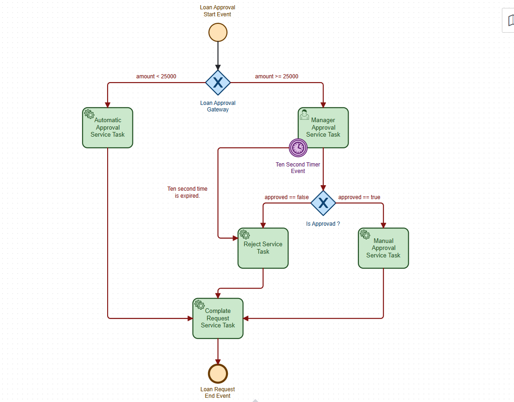

# Spring Boot Camunda Loan Approval Test Projesi

## Proje Mimarisi

```mermaid
flowchart LR
    A[Sıfırlama / Başlatma İsteği] -->|GET /approveloanrequest/{amount}| B[LoanApprovalController]
    B -->|processKey=LoanApprovalProcess + amount| C[Camunda Process Engine]
    C -->|amount < 25000| D[LoanApprovalService]
    C -->|amount >= 25000| E[Manager Approval User Task]
    E -->|approved == true| D
    E -->|approved == false veya 10 sn timeout| F[LoanRejectService]
    D --> G[CompleteRequestService]
    F --> G
    G --> H[Process End]
```




> Not: BPMN süreci `src/main/resources/LoanApprovalProcess.bpmn` dosyasında tanımlıdır.

---

## 📌 Bu Proje Nedir?

Bu proje, **Spring Boot** ve **Camunda Platform 7** kullanılarak hazırlanmış basit bir **kredi onay akışı** örneğidir.

Proje; gelen kredi talebini `amount` değişkenine göre otomatik olarak onaylayan, gerekirse kullanıcı onayına düşüren ve sonunda süreci tamamlayan bir BPMN akışı içerir.

### Temel Özellikler
- HTTP üzerinden süreç başlatma
- `amount < 25000` ise otomatik onay
- `amount >= 25000` ise yönetici onayı
- Yönetici onayı verilmezse veya 10 saniye içinde işlem tamamlanmazsa reddetme
- Süreç sonunda durumun `APPROVED` veya `REJECTED` olarak loglanması
- Camunda Web Uygulaması ve H2 veritabanı ile tek projede çalışma

---

## 🧠 Nasıl Çalışır?

### Akış Özeti
1. Kullanıcı `/approveloanrequest/{amount}` adresine istek atar.
2. `LoanApprovalController`, `LoanApprovalProcess` süreç örneğini başlatır.
3. BPMN içindeki gateway, `amount` değerine göre akışı yönlendirir.
4. Küçük tutarlar otomatik onaylanır.
5. Büyük tutarlar için kullanıcı onayı beklenir.
6. Onay/reddetme sonucuna göre süreç tamamlanır.
7. `CompleteRequestService`, son durumu loglar.

### Süreç Kuralları
- `amount < 25000` → `LoanApprovalService`
- `amount >= 25000` → `Manager Approval Service Task`
- `approved == true` → `LoanApprovalService`
- `approved == false` → `LoanRejectService`
- `Manager Approval Service Task` için **10 saniyelik boundary timer** vardır

---

## 🛠 Kullanılan Teknolojiler

[](https://www.java.com/en/)
[](https://spring.io/projects/spring-boot)
[](https://camunda.com/)
[](https://maven.apache.org/)
[](https://www.h2database.com/)

Projede kullanılan ana bağımlılıklar:
- `spring-boot-starter-web`
- `spring-boot-starter-jdbc`
- `h2`
- `camunda-bpm-spring-boot-starter-rest`
- `camunda-bpm-spring-boot-starter-webapp`

---

## 📁 Proje Yapısı

```text
src/main/java/com/furkankayam/
├── SpringBootCamundaTest.java
├── config/
│   └── CamundaConfig.java
├── controller/
│   └── LoanApprovalController.java
└── service/
    ├── CompleteRequestService.java
    ├── LoanApprovalService.java
    └── LoanRejectService.java

src/main/resources/
├── application.yaml
└── LoanApprovalProcess.bpmn
```

### Dosya Görevleri
- `SpringBootCamundaTest.java` → Uygulamanın başlangıç noktası
- `LoanApprovalController.java` → Süreç başlatma endpoint’i
- `LoanApprovalService.java` → Onaylanan taleplerin işlenmesi
- `LoanRejectService.java` → Reddedilen taleplerin işlenmesi
- `CompleteRequestService.java` → Sürecin son durumunu loglama
- `LoanApprovalProcess.bpmn` → Camunda süreç akışı
- `application.yaml` → H2 ve Camunda ayarları

---

## 🔄 BPMN Süreci

`LoanApprovalProcess` süreci şu adımlardan oluşur:

1. **Start Event**
2. **Exclusive Gateway**
   - `amount < 25000` ise otomatik onay
   - `amount >= 25000` ise kullanıcı onayı
3. **User Task**
   - Yönetici onayı beklenir
4. **Exclusive Gateway**
   - `approved == true` → onay
   - `approved == false` → red
5. **Boundary Timer Event**
   - Yönetici görevi 10 saniye içinde tamamlanmazsa reddetme akışı çalışır
6. **Complete Request Task**
7. **End Event**

### Süreç Değişkenleri
- `amount` → kredi tutarı
- `approved` → yönetici onay durumu
- `status` → sürecin son durumu (`APPROVED` / `REJECTED`)

---

## 🧩 Kod Bileşenleri

### `LoanApprovalController`
Süreci başlatan REST controller’dır.

Kullanılan endpoint:

```http
GET /approveloanrequest/{amount}
```

Örnek:

```http
GET /approveloanrequest/15000
```

Bu istek, `LoanApprovalProcess` sürecini `amount=15000` ile başlatır.

### `LoanApprovalService`
Onaylanan kredi taleplerinde çalışır ve:
- `status = APPROVED` yazar
- Log mesajı üretir

### `LoanRejectService`
Reddedilen taleplerde çalışır ve:
- `status = REJECTED` yazar
- Log mesajı üretir

### `CompleteRequestService`
Sürecin son adımında `status` değişkenini kontrol eder ve son durumu loglar.

### `CamundaConfig`
`camunda.*` yapılandırma grubunu bağlamak için kullanılan basit bir `@ConfigurationProperties` sınıfıdır.

---

## ⚙️ Konfigürasyon

`src/main/resources/application.yaml` dosyasında temel ayarlar bulunur.

### H2 Veritabanı
- URL: `jdbc:h2:mem:camunda-db;DB_CLOSE_DELAY=-1;DB_CLOSE_ON_EXIT=FALSE`
- Kullanıcı adı: `sa`
- Şifre: boş
- H2 console: aktif

### Camunda Ayarları
- Admin kullanıcı: `admin`
- Admin şifre: `admin`
- Tasklist filtresi: `All tasks`
- Job execution wait time: `1000 ms`

> Not: `job-execution.wait-time-in-millis` değeri test ve geliştirme sırasında süreçlerin daha hızlı çalışması için düşürülmüştür.

---

## 🚀 Projeyi Çalıştırma

### Gereksinimler
- Java 17+
- Maven 3.9+
- İsteğe bağlı olarak Camunda Web Uygulamasını görüntülemek için tarayıcı

### Uygulamayı Başlatma

```powershell
mvn spring-boot:run
```

### Testleri Çalıştırma

```powershell
mvn test
```

### Camunda Web Arayüzü
Uygulama başladıktan sonra genellikle aşağıdaki adreslerden erişim sağlanır:

- Camunda Webapp: `http://localhost:8080/camunda`
- H2 Console: `http://localhost:8080/h2-console`

> Eğer port veya context path değiştirildiyse bu adresler de güncellenmelidir.

---

## 🧪 Örnek Kullanım Senaryoları

### 1) Otomatik Onay
```http
GET /approveloanrequest/10000
```

Bu durumda süreç doğrudan otomatik onay yoluna gider.

### 2) Yönetici Onayı Gereken Talep
```http
GET /approveloanrequest/50000
```

Bu durumda süreç kullanıcı onayına düşer.

### 3) Zaman Aşımı ile Red
Yönetici onayı 10 saniye içinde verilmezse boundary timer devreye girer ve talep reddedilir.

---

## 🧯 Sorun Giderme

### Uygulama başlamıyor
- Java sürümünün 17 olduğundan emin olun.
- `pom.xml` içindeki bağımlılıkların indirilebildiğini kontrol edin.
- `application.yaml` içindeki yapılandırmaların bozulmadığını doğrulayın.

### Camunda ekranı açılmıyor
- Uygulamanın gerçekten ayağa kalktığını loglardan kontrol edin.
- `http://localhost:8080/camunda` adresini deneyin.

### H2 Console boş geliyor
- H2 veritabanı in-memory çalışır; uygulama kapanınca veriler silinir.
- Konsol URL’sini `application.yaml` ayarlarıyla eşleştirin.

### Süreç değişkeni hataları
- BPMN içindeki `amount` ve `approved` değişkenlerinin doğru gönderildiğinden emin olun.
- `approved` değişkeni olmadan manuel onay akışı tamamlanmaz.

---

## ✅ Test Durumu

Bu repoda şu an hazır bir test sınıfı bulunmamaktadır; ancak proje derlenebilir durumdadır.

Kontrol için:

```powershell
mvn test
```

---

## 🔐 Güvenlik Notu

- Üretim ortamında H2 yerine kalıcı bir veritabanı kullanılması önerilir.
- `admin/admin` gibi varsayılan Camunda kimlik bilgilerini üretimde değiştirmeyin.
- Gerçek ortamda süreç değişkenlerini ve kullanıcı girişlerini doğrulayan ek kontroller ekleyin.

---

## 📄 Lisans

Bu proje için ayrıca bir lisans dosyası eklenmemiştir. Dilerseniz `LICENSE` dosyası oluşturarak lisans bilgisini netleştirebilirsiniz.

---

## 👨‍💻 Yazar

**Mehmet Furkan KAYA**

